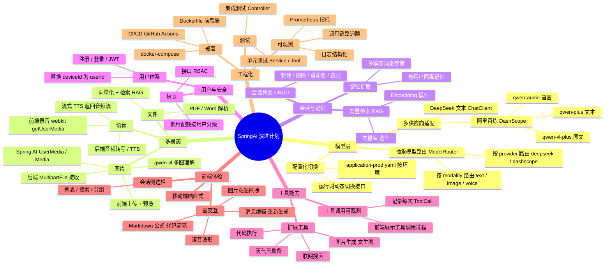
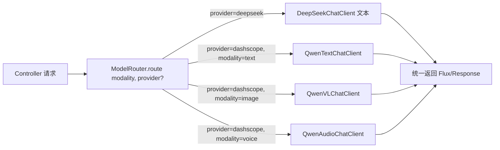
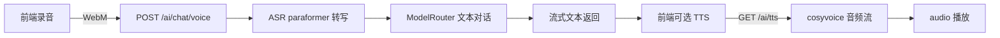
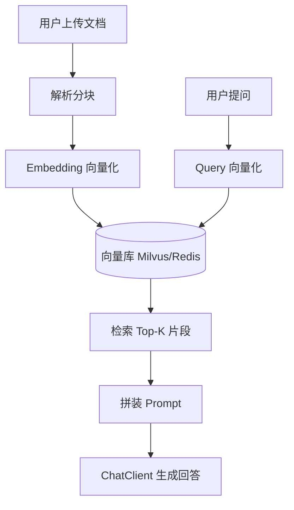
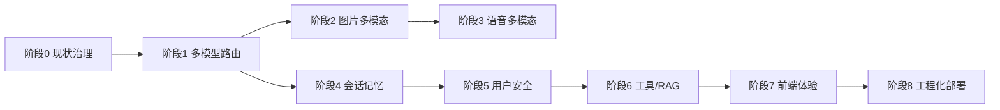

# SpringAi 功能完善 / 多模态演进 计划

> 当前现状：仅接入 **DeepSeek**（纯文本对话，无多模态）。
> 目标：在不破坏现有对话链路前提下，演进为**多模型可切换 + 多模态（图片/语音）**的 AI 对话平台，未来可平滑接入**阿里云百炼（DashScope）**。

---

## 一、项目现状盘点

| 维度 | 现状 | 缺口 |
|------|------|------|
| 大模型 | Spring AI `ChatClient` 单一 DeepSeek 配置 | 无法切换模型 / 无多模态 |
| 对话记忆 | `MessageWindowChatMemory`(20) + MongoDB | 仅文本，不存图片/音频 |
| 工具函数 | 高德地图 / 情绪 / 时间 | 已具备 Function Calling 基础 |
| 鉴权限流 | `DeviceIdInterceptor` + Redis 计数 | 无用户体系，无 Token 鉴权 |
| 前端 | React + Vite，仅文本流式 + Markdown 渲染 | 无图片上传 / 语音输入 / 历史会话切换 |
| 会话管理 | 会话 ID 硬编码 `"2"`（见 `ai.tsx`） | 无会话列表、无新建/删除/重命名 |
| 部署 | 本地启动 | 无容器化、无 CI/CD |

---

## 二、演进总览思维导图



---

## 三、分阶段精细计划

### 阶段 0：现状治理（基础修复，必做）

> 目标：修掉阻碍后续演进的硬编码与单模型耦合。

- [ ] **0.1 修复会话 ID 硬编码**
  - 前端 `ai.tsx` 中 `id: "2"` 改为动态生成（UUID）或从侧边栏选中会话传入
- [ ] **0.2 抽取模型配置**
  - `application.yaml` 中 `spring.ai.deepseek.*` 迁移到 `spring.ai.models.<provider>.*` 结构
  - 新增 `ModelProviderProperties` 统一管理 provider / model / api-key / base-url
- [ ] **0.3 补全测试骨架**
  - `s_ai_bankend/src/test` 当前为空，补 `AiChatService` / `AiChatAboutService` 单测
- [ ] **0.4 API Key 安全化**
  - 见 `readme.md` 中方案 A（环境变量）/ 方案 C（Jasypt）

---

### 阶段 1：多模型路由层（核心架构）

> 目标：DeepSeek 与百炼并存，可按请求路由。

- [ ] **1.1 定义模型路由抽象**



- [ ] **1.2 实现 `ModelRouter`**
  - 接口：`Flux<String> chat(ChatRequest req)`
  - 字段：`modality`（TEXT/IMAGE/VOICE）、`provider`（可选，默认按配置）
  - 内部维护 `Map<Provider, ChatClient>` Bean
- [ ] **1.3 引入百炼 DashScope 依赖**
  - `spring-ai-alibaba-starter`（Spring AI Alibaba）
  - 配置 `spring.ai.dashscope.api-key` / `model.*`
- [ ] **1.4 ChatConfiguration 改造**
  - 现有单一 `ChatClient` Bean → 改为按 provider 注册多个 Bean
  - 工具函数（高德/情绪/时间）注入到所有文本类 ChatClient
- [ ] **1.5 接口扩展**
  - `GET /ai/chat/{id}` 新增可选参数 `?provider=dashscope&modality=text`
  - 默认行为不变（向后兼容）

---

### 阶段 2：多模态 - 图片

> 目标：用户上传图片，AI 理解图片内容并对话。

- [ ] **2.1 后端：图片接收 + 多模态消息**
  - 新增 `POST /ai/chat/image/{id}`（multipart）
  - 用 Spring AI `Media` / `UserMessage` 携带图片：
    ```java
    var media = new Media(MimeTypeUtils.IMAGE_PNG, imageResource);
    var msg = UserMessage.builder().text(prompt).media(media).build();
    ```
  - 路由到 `QwenVLChatClient`（qwen-vl-plus）
- [ ] **2.2 记忆层扩展**
  - MongoDB 文档结构新增 `mediaType` / `mediaUrl` 字段
  - 图片存对象存储（本地 `media/` 目录起步，后续接 OSS）
- [ ] **2.3 前端：图片上传**
  - `MessageInput.tsx` 新增上传按钮 + 拖拽 + 粘贴
  - `MessageBubble.tsx` 渲染图片缩略图
  - `types/Message.ts` 扩展 `media?: { type: 'image', url: string }[]`
- [ ] **2.4 前端：上传 UI**
  - 预览区、进度条、删除
  - 支持多图（≤4 张）

---

### 阶段 3：多模态 - 语音

> 目标：语音输入转文本对话 + 文本转语音播报。

- [ ] **3.1 前端录音**
  - `webkitAudioContext` + `MediaRecorder` 采集 WebM/PCM
  - 录音按钮 + 波形可视化（`wavesurfer.js`）
- [ ] **3.2 后端 ASR（语音转文字）**
  - `POST /ai/chat/voice/{id}` 上传音频
  - 调用百炼 `paraformer` 或 Whisper 转写
  - 转写文本走阶段 1 文本对话链路
- [ ] **3.3 后端 TTS（文字转语音）**
  - `GET /ai/tts/{id}` 返回音频流
  - 百炼 `cosyvoice` 或 Edge TTS
  - 前端 `<audio>` 播放，支持流式



---

### 阶段 4：会话与记忆增强

- [ ] **4.1 会话列表 CRUD**
  - 后端：`GET/POST/DELETE/PUT /ai/conversation`
  - MongoDB `conversations` 集合：`_id / userId / title / createTime / lastMessage / pinned`
  - 前端：`SideListMenu.tsx` 接真实接口，支持新建/删除/重命名/置顶
- [ ] **4.2 多模态记忆**
  - `MessageWindowChatMemory` 扩展或自实现 `ChatMemory`
  - 存储图片 URL / 音频 URL 引用
- [ ] **4.3 记忆按用户隔离**
  - 当前按 `conversationId`，未与用户绑定
  - 阶段 5 用户体系上线后，`conversationId` = `userId + sessionId`

---

### 阶段 5：用户与安全

- [ ] **5.1 用户体系**
  - 表 `users`：手机号/邮箱 + 密码（BCrypt）
  - JWT 签发 / 刷新
  - 前端登录页 + 路由守卫
- [ ] **5.2 替换 deviceId**
  - `DeviceIdInterceptor` → `JwtAuthInterceptor`
  - 限流键 `device:call_count:` → `user:call_count:{userId}`
  - 配额按用户分级（普通/会员）
- [ ] **5.3 接口权限**
  - RBAC 注解 `@PreAuthorize`
  - 管理后台接口（用户管理、调用统计）

---

### 阶段 6：工具能力扩展

- [ ] **6.1 新增工具**
  - `ImageGenTool`：文生图（百炼 `wanx` / 智谱 CogView）
  - `WebSearchTool`：联网搜索（Tavily / SerpAPI）
  - `CodeExecTool`：沙箱执行（judge0 / 自建 Docker）
- [ ] **6.2 工具调用可观测**
  - 后端记录每次 `@Tool` 调用：`tool_calls` 集合
  - 前端消息流中展示"正在调用：高德天气..."过程卡片
- [ ] **6.3 RAG 知识库**
  - `EmbeddingModel`（百炼 `text-embedding-v2`）
  - 向量库：Milvus / Redis Stack（起步用 Redis）
  - 文档解析：PDF / Word / Markdown
  - `QuestionAnswerAdvisor` 接入 ChatClient



---

### 阶段 7：前端体验升级

- [ ] **7.1 会话侧边栏完善**（依赖阶段 4）
  - 列表分组（今天 / 昨天 / 更早）
  - 搜索、置顶、批量删除
- [ ] **7.2 消息富交互**
  - 消息编辑后重新生成
  - 复制 / 重新生成 / 点赞反馈
  - Markdown：公式（KaTeX）、代码高亮（Shiki）、表格、Mermaid
- [ ] **7.3 多模态 UI**
  - 图片粘贴 / 拖拽上传
  - 语音输入波形 + 倒计时
  - TTS 播放控件
- [ ] **7.4 响应式与 PWA**
  - 移动端布局
  - Service Worker 离线缓存

---

### 阶段 8：工程化与部署

- [ ] **8.1 测试**
  - 后端：JUnit5 + Mockito（Service/Tool）+ MockMvc（Controller）
  - 前端：Vitest + React Testing Library
  - E2E：Playwright
- [ ] **8.2 容器化**
  - `s_ai_bankend/Dockerfile`（多阶段构建，JDK 17）
  - `s_ai_frontend/Dockerfile`（Vite build + Nginx）
  - `docker-compose.yml`：app + mongo + redis + （可选）milvus
- [ ] **8.3 CI/CD**
  - GitHub Actions：lint → test → build → image → push
  - 自动部署到服务器
- [ ] **8.4 可观测**
  - 结构化日志（Logback JSON）
  - 链路追踪（Micrometer Tracing + OTLP）
  - 指标（Prometheus：QPS / 延迟 / Token 消耗）

---

## 四、优先级路线图



| 阶段 | 优先级 | 预估 | 依赖 |
|------|--------|------|------|
| 0 现状治理 | P0 必做 | 2-3 天 | 无 |
| 1 多模型路由 | P0 必做 | 4-5 天 | 阶段 0 |
| 2 图片多模态 | P1 高 | 4-5 天 | 阶段 1 |
| 3 语音多模态 | P2 中 | 5-6 天 | 阶段 1 |
| 4 会话记忆 | P1 高 | 4-5 天 | 阶段 0 |
| 5 用户安全 | P1 高 | 5-6 天 | 阶段 4 |
| 6 工具/RAG | P2 中 | 6-8 天 | 阶段 1 |
| 7 前端体验 | P1 高 | 持续 | 阶段 2/3/4 |
| 8 工程化 | P2 中 | 3-4 天 | 各阶段稳定后 |

---

## 五、技术选型清单

| 能力 | 选型 | 说明 |
|------|------|------|
| 多模型框架 | Spring AI + Spring AI Alibaba | 百炼官方 starter，原生支持 qwen-vl/audio |
| 向量库 | Redis Stack（起步）→ Milvus（生产） | 复用现有 Redis，降低运维 |
| 对象存储 | 本地 `media/` → 阿里云 OSS | 图片/音频/文档 |
| 用户鉴权 | Spring Security + JWT | 轻量，无需 session |
| 前端状态 | Zustand（现有）| 已在用 |
| 前端 Markdown | markdown-it + KaTeX + Shiki | 增强渲染 |
| 前端语音 | MediaRecorder API + wavesurfer.js | 原生能力 |
| 容器 | Docker + docker-compose | 单机起步 |
| CI/CD | GitHub Actions | 仓库在 GitHub 时零成本 |

---

## 六、关键风险与对策

1. **百炼 API 限频 / 计费**：前端展示 Token 消耗；后端按用户配额熔断（Resilience4j）。
2. **多模态记忆膨胀**：图片/音频只存 URL，正文存文本；冷数据归档。
3. **模型切换语义不一致**：DeepSeek 与 Qwen Prompt 风格不同，`ChatConfiguration` 中 system prompt 按 provider 分桶。
4. **前端流式 SSE 兼容**：当前用 `fetch + ReadableStream`，多模态需改 SSE（`EventSource` / `@microsoft/fetch-event-source`）以支持多类型事件（文本/图片/工具调用）。
5. **DeepSeek 无多模态**：路由层检测到 `modality != TEXT` 且 `provider == deepseek` 时自动降级到百炼。
