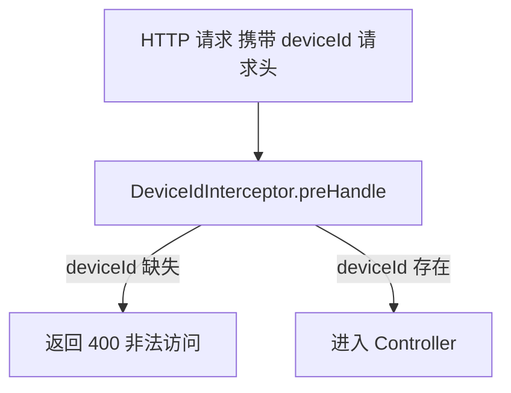
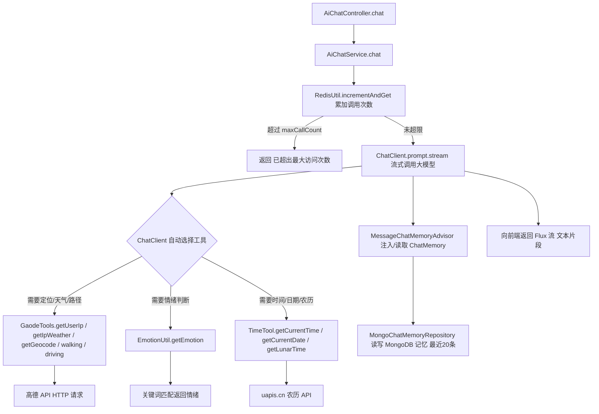
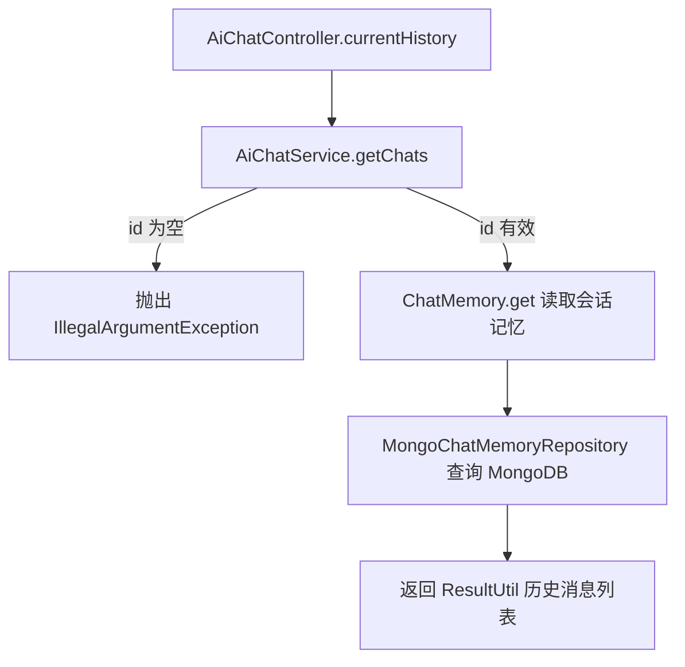
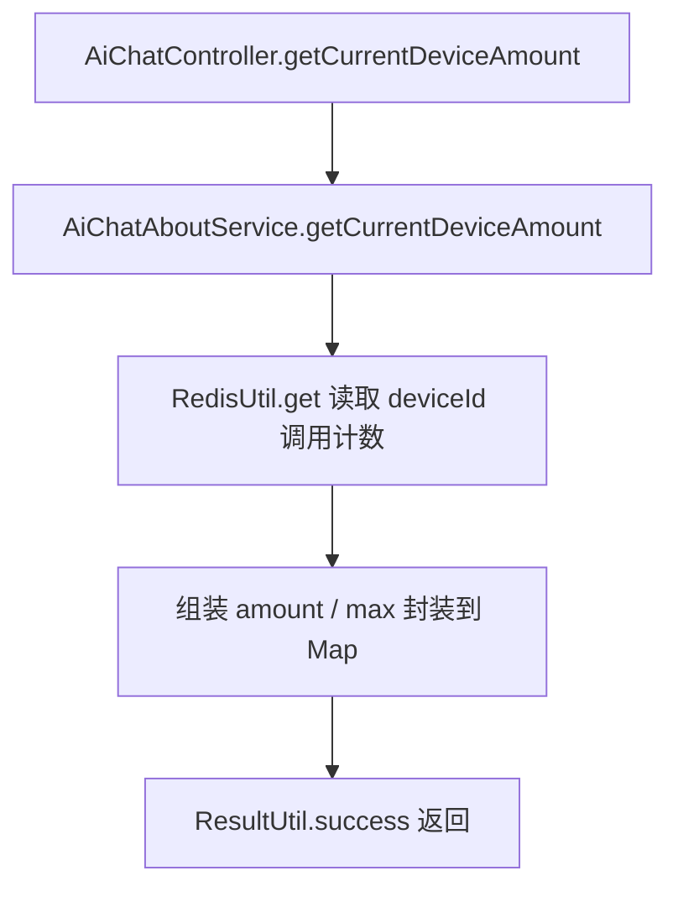

# SpringAi 项目说明

基于 Spring AI + React 的 AI 对话项目。后端使用 Spring Boot 3 整合 Spring AI，通过高德地图、情绪分析、时间等工具函数增强大模型能力，对话记忆存储在 MongoDB，调用次数限制在 Redis。前端为 React + Vite 单页应用。

---

## 一、项目结构

```
SpringAi/
├── s_ai_bankend/                # 后端（Spring Boot + Spring AI）
│   └── src/main/java/ai/s_ai/
│       ├── controller/          # AiChatController     接口层
│       ├── service/             # AiChatService / AiChatAboutService
│       ├── tools/               # GaodeTools / EmotionUtil / TimeTool
│       ├── configuration/       # ChatConfiguration / RedisConfig ...
│       ├── components/          # PromptXmlReader / Redis 模板 / 配置属性
│       ├── verification/        # DeviceIdInterceptor  设备鉴权拦截器
│       └── utils/               # RedisUtil / ResultUtil / ReadXmlUtil
└── s_ai_frontend/               # 前端（React + Vite + TS）
    └── src/
        ├── pages/               # 页面（App / ai）
        ├── components/          # UI 组件
        ├── router/              # 路由（index.ts / ai.ts）
        ├── store/               # 状态管理
        └── hooks/               # 自定义 hooks
```

---

## 二、请求执行路线思维导图

> 说明：箭头表示「请求 → 函数/方法」的调用链路（`A → B → C`）。

### 全局拦截（所有 `/ai` 请求）



---

### 请求一：AI 流式对话 `GET /ai/chat/{id}`



---

### 请求二：获取当前会话历史 `GET /ai/currentHistory/{id}`



---

### 请求三：获取设备调用次数 `GET /ai/getCurrentDeviceAmount`



---

## 三、核心依赖与配置

| 模块 | 技术 | 作用 |
|------|------|------|
| 对话大模型 | Spring AI `ChatClient` | 流式对话、工具调用 |
| 对话记忆 | `MessageWindowChatMemory`(20) + MongoDB | 按会话 ID 保存最近 20 条 |
| 设备鉴权 | `DeviceIdInterceptor` | 校验 `deviceId` 请求头 |
| 限流 | Redis `incrementAndGet`（24h 过期） | 单设备每日最大调用次数 |
| 工具函数 | 高德地图 / 情绪 / 时间 | 增强大模型外部感知能力 |
| 文档 | Swagger / OpenAPI 3 | 接口文档 |

---

## 四、本地运行

后端：`s_ai_bankend` 下 `./mvnw spring-boot:run`（需配置高德 `config.gaode.*`、MongoDB、Redis）。

前端：`s_ai_frontend` 下 `pnpm install && pnpm dev`（Vite 默认端口 5173）。
