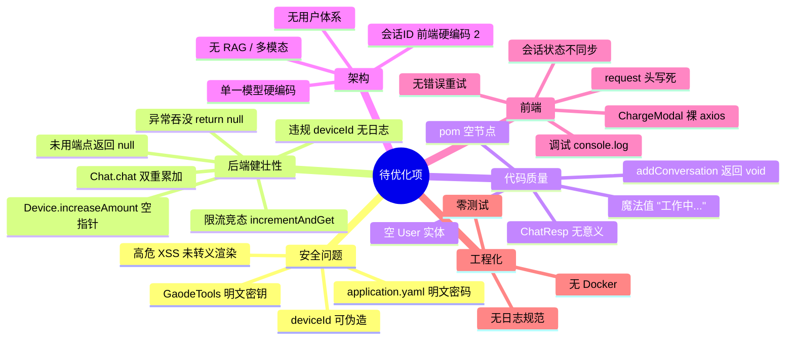
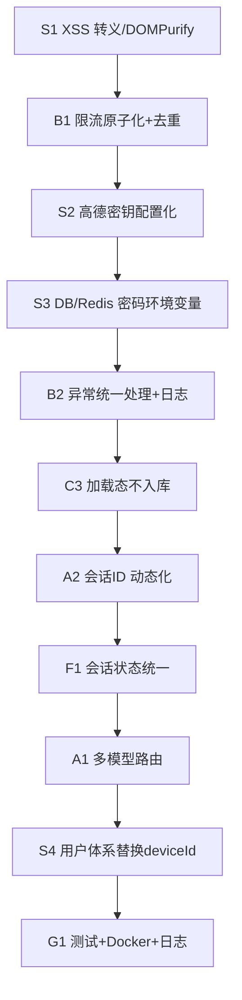

# SpringAi 项目审查报告（待优化项）

> 审查日期：2026-08-21
> 范围：后端 `s_ai_backend`（Spring Boot 4.1 / Spring AI 2.0）+ 前端 `s_ai_frontend`（React + Vite + Zustand）
> 结论：**存在 1 个高危安全问题、多处健壮性/安全/架构债务**，建议按优先级逐步修复。

---

## 一、问题总览思维导图

---

## 二、安全问题（优先级最高）

### 🔴 S1【高危】前端 Markdown 渲染未转义 → XSS 漏洞
- 位置：`s_ai_frontend/src/utils/markdown.ts:65` 的 `html(html)` 方法 **直接透传原始 HTML**；`MessageBubble.tsx:19` 用 `dangerouslySetInnerHTML` 渲染。
- 风险：AI 回复或工具返回内容若含 `<script>` / `` 等，会直接执行。虽然当前文本来自模型，但工具（如高德、联网搜索）返回内容不可信。
- 修复：
  - 移除 `html()` 的透传，改用转义；或
  - 渲染前用 DOMPurify 清洗：`DOMPurify.sanitize(markdown.parse(content))`；
  - 同时启用 CSP 响应头。

### 🟠 S2【中】高德密钥明文写在工具类中
- 位置：`GaodeTools.java` 内 `String key = "你的应用key"`。密钥硬编码进源码并会进入 Git 仓库 / jar 包。
- 修复：改用配置注入 `@Value("${config.gaode.apikey}")`，与 `application.yaml` 已有配置对齐；并用环境变量（已支持 `spring-dotenv` + `.env`）。

### 🟠 S3【中】application.yaml 明文数据库 / Redis 密码
- 位置：`application.yaml:15` MongoDB `root:123456`，`:20` Redis `123456`。
- 当前 `DEEPSEEK_API_KEY` / `GAODE_API_KEY` 已用 `${...}` 占位（良好），但数据库密码仍明文。
- 修复：统一改为 `${MONGODB_PASSWORD}` / `${REDIS_PASSWORD}` 环境变量。

### 🟠 S4【中】deviceId 可随意伪造，鉴权形同虚设
- 位置：`DeviceIdInterceptor` 仅校验请求头是否存在，任意客户端可伪造任意 `deviceId` 绕过配额。
- 修复：阶段 5 引入 JWT 用户体系替换；短期至少对 `deviceId` 做签名校验（HMAC）。

---

## 三、后端健壮性问题

### B1【高】限流存在竞态 & 计数口径错误
- 位置：`RedisUtil.incrementAndGet` 用 `ops.increment()` 后 `expire()` 是**两步非原子**：并发下 `expire` 可能覆盖 / 漏设 TTL，导致计数永不过期。
- 位置：`AiChatService.chat` 先 `incrementAndGet` 累加，异常时又 `incrementAndGet` **二次累加**（每轮对话实际 +2）。
- 修复：
  - 用 `RedisTemplate.execute(connection -> connection.stringCommands().incrEx(...))` 原子自增并设过期；
  - 异常分支不应再累加，或改用"先判断后消费"语义。

### B2【中】异常被吞没，返回 null
- 位置：`AiChatService.chat` 的 `catch { return null; }`、`getChats` 的 `catch { return null; }`。
- 风险：前端收到 `null` 无法区分"无数据 / 出错了"，且错误无日志，线上难以排查。
- 修复：抛业务异常 → `GlobalException` 统一转 `ResultUtil`；记录 `log.error`。

### B3【中】违规 deviceId 仅返回 400，无日志/无防刷
- 位置：`DeviceIdInterceptor.preHandle`。频繁扫描会被放行后拒绝，但无审计日志。
- 修复：补 `log.warn`（含 IP），必要时接入限流。

### B4【低】未使用的端点返回 null
- 位置：`AiChatAboutService.handwritingReception` 直接 `return null;`（接口保留但无实现）。
- 修复：要么实现，要么删除该端点与路由，避免误导。

### B5【低】`Device.increaseAmount` 空指针风险
- 位置：`Device.java:18` `this.amount += 1;` 当 `amount==null` 触发 NPE。
- 修复：初始化为 `0` 或判空。

---

## 四、代码质量 / 死代码

### C1【低】空实体 `User`
- 位置：`entity/User.java` 为空类，疑似预留但未使用。建议删除或补全用户体系（见 plan.md 阶段 5）。

### C2【低】`ChatResp` 无实际用途
- 位置：`entity/ChatResp.java` 未被任何调用方使用（流式接口直接返回 `Flux<String>`）。建议删除。

### C3【中】前端魔法值 & 临时态文案
- 位置：`MessageInput.tsx:39` 占位文案 `"工作中......"` 直接进消息流，用户可见且会被存入记忆。
- 修复：用独立的 `loading` 状态展示转圈，不写入 `messages` / 记忆。

### C4【低】`useConversation.addConversation` 返回 void
- 位置：`store/useConversation.ts:28` 创建会话后未自动切换/选中新会话，用户点"新建"无反馈。
- 修复：返回新会话 id 并 `selConversation(id)`。

### C5【低】pom.xml 空节点
- 位置：`pom.xml:17-28` `<licenses>/<developers>/<scm>` 均为空，Maven 打包会告警。建议删除或补全。

---

## 五、架构债务

### A1【高】模型调用硬编码单一 DeepSeek
- 位置：`ChatConfiguration` 只构建 `deepseekChatClient`；`AiChatService.chat` 写死用 `chatClient`。
- 影响：无法直接接百炼多模态（plan.md 阶段 1）。
- 修复：引入 `ModelRouter`，按 provider/modality 路由。

### A2【中】会话 ID 前端硬编码 `"2"`
- 位置：`store/useMessage.ts:14` 初始 `id: "2"`；历史读取依赖该值。
- 影响：用户首次进入固定读会话 2，无法自然新建。
- 修复：与 `useConversation` 联动，初始化时若无会话则自动 `createConversation`。

### A3【中】无用户体系
- 仅 `deviceId` 维度，无法多端/多账号；记忆与用户无绑定（plan.md 阶段 5）。

### A4【低】无 RAG / 多模态扩展点
- 当前工具函数已具备 Function Calling 基础，但图片/语音/文档无入口。

---

## 六、前端问题

### F1【中】会话状态与消息不同步
- 位置：`useMessage.id` 与 `useConversation.conversation.id` 是**两套状态**。`MessageInput` 用 `currentConversation.id`，但刷新历史用的是 `useMessage.getMessages(id)` 里的旧 id。
- 修复：统一以 `useConversation.conversation.id` 为准，切换会话时触发 `getMessages`。

### F2【低】`ChargeModal` 绕过封装直接用 axios
- 位置：`MessageCharge.tsx:47` `axios.get("/api/charge/getCharges")` 未走 `utils/request`，无 `deviceId` 头、无超时、无统一错误处理。
- 修复：改用 `request.get` 或 `api/ChargeApi`。

### F3【低】调试 `console.log` 残留
- 位置：`store/useMessage.ts:31` `console.log(id)`。生产应移除。

### F4【低】request 头写死 + 超时偏短
- 位置：`utils/request.ts:8` `timeout: 5000` 对流式 AI 对话太短；`deviceId` 在创建时固定，不随刷新变化（合理，但 `getDeviceId()` 在模块加载时即调用一次，无法动态刷新）。

### F5【低】无网络错误重试 / 无超时兜底 UI
- 流式中断时仅 `updateLastMessage(error.message)` 把错误塞进对话流。

---

## 七、工程化缺失

- **G1 零测试**：`src/test` 为空，关键 Service / Tool 无单测（plan.md 阶段 8）。
- **G2 无 Docker / docker-compose**：本地强依赖本机 MongoDB/Redis。
- **G3 无结构化日志**：仅 `System.out.println`（如 `PromptXmlReader`、`ReadXmlUtil`），无 SLF4J、无日志级别。
- **G4 无 API 鉴权/限流守卫**：生产环境接口裸露。
- **G5 Swagger 未设置安全方案**：knife4j 未配置 `apiKey` 头，文档调试需手动填 deviceId。

---

## 八、优先级修复清单

| 编号 | 问题 | 优先级 | 工作量 |
|------|------|--------|--------|
| S1 | XSS 未转义渲染 | 🔴 高 | 0.5 天 |
| S2 | 高德密钥硬编码 | 🟠 中 | 0.5 天 |
| S3 | 数据库/Redis 密码明文 | 🟠 中 | 0.5 天 |
| S4 | deviceId 可伪造 | 🟠 中 | 2 天（完整方案见 plan 阶段5） |
| B1 | 限流竞态 + 双重累加 | 🔴 高 | 1 天 |
| B2 | 异常吞没返回 null | 🟡 中 | 0.5 天 |
| A1 | 模型硬编码 | 🔴 高 | 4 天（plan 阶段1） |
| A2 | 会话ID 硬编码 2 | 🟡 中 | 1 天 |
| F1 | 会话/消息状态不同步 | 🟡 中 | 1 天 |
| C3 | "工作中" 写入消息流 | 🟡 中 | 0.5 天 |
| G1-G3 | 测试/容器/日志 | 🟡 中 | 3 天 |

---

## 九、建议修复顺序

> 说明：S1 / B1 / S2 / S3 属于"立即修"；A1 / A2 / F1 属于架构演进，可并入 plan.md 阶段 0-1。
